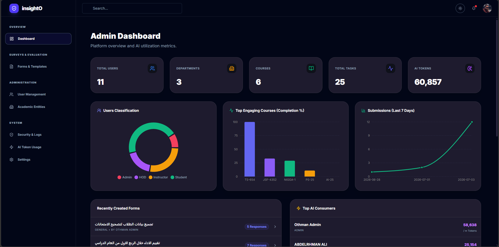
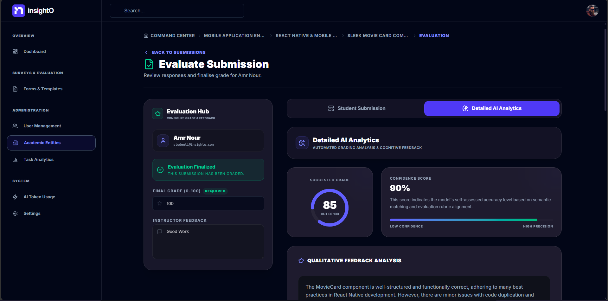
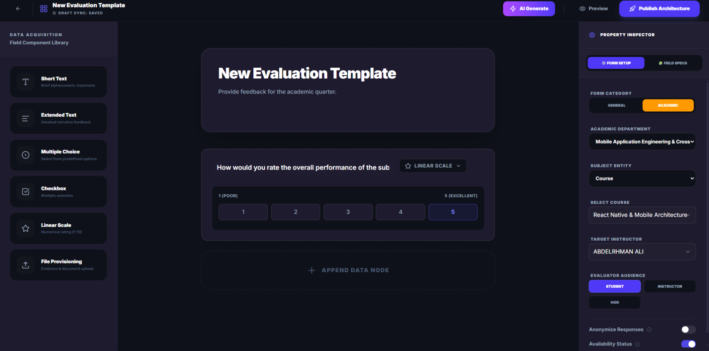
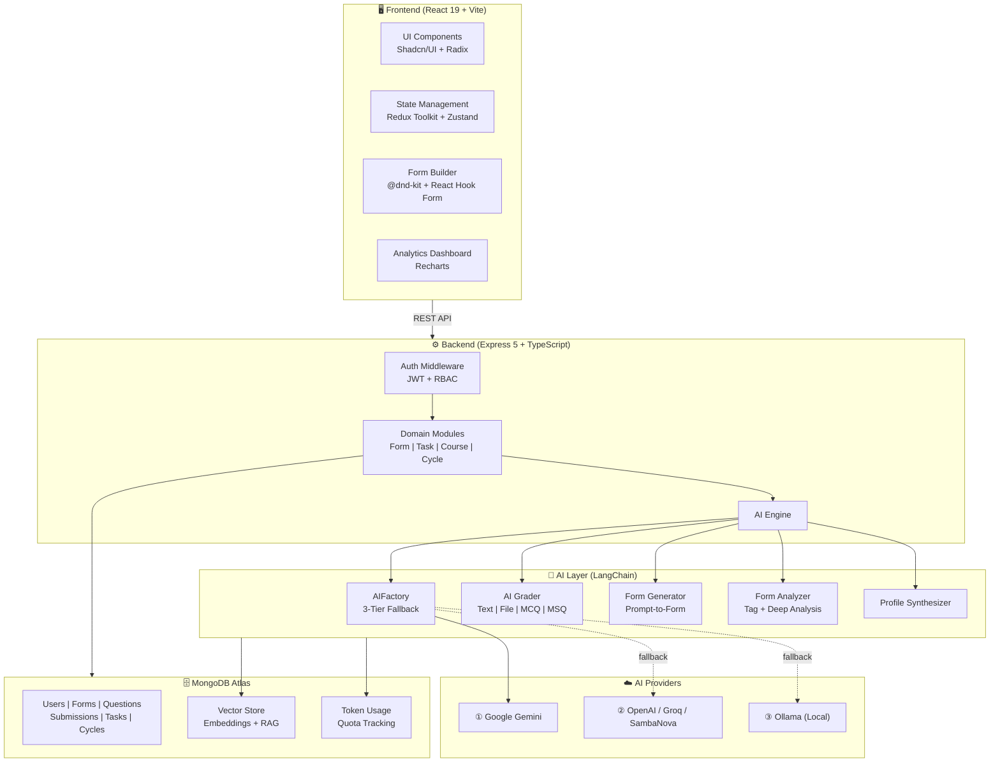

<p align="center">
  
</p>

<h1 align="center">InsightO</h1>

<p align="center">
  <strong>🧠 AI-Powered 360° Evaluation Platform for Educational Excellence</strong>
</p>

<p align="center">
  Bridging subjective feedback with objective performance — so institutions stop guessing and start <em>knowing</em>.
</p>

<p align="center">
  <a href="#"></a>
  <a href="#"></a>
  <a href="#"></a>
  <a href="#"></a>
  <a href="#"></a>
  <a href="#"></a>
  <a href="#"></a>
</p>

---

## 🎬 Demo & Visuals

> _Seeing is believing. Here's InsightO in action._

<p align="center">
  <a href="https://youtu.be/8bQ2izNfzR4">
    
  </a>
  <br/>
  <em>▲ Click to watch — Full Platform Walkthrough on YouTube</em>
</p>

| Dashboard & Analytics | AI-Powered Grading | Dynamic Form Builder |
|:---:|:---:|:---:|
|  |  |  |
| Real-time evaluation trends, sentiment mapping, and performance curves | Deep cognitive analysis with criteria breakdown, concept mastery, and quality metrics | Drag-and-drop builder with AI-generated questions from prompts or uploaded files |

---

## 🤔 Why InsightO?

> **The Problem:** Educational institutions collect mountains of feedback surveys and student assignments — but lack the tools to extract _actionable intelligence_ from them. Feedback data lives in silos. Grading is inconsistent. Trend analysis is manual. Systemic bottlenecks go undetected for semesters.

> **The Solution:** InsightO creates a **unified evaluation ecosystem** that merges _qualitative sentiment_ (survey feedback) with _quantitative performance_ (AI-graded submissions) to deliver a **360-degree institutional health report**.

### 💡 The Business Impact

| Challenge | InsightO's Answer |
|---|---|
| **Fragmented Feedback** | Centralized survey engine with AI-tagged categorization and cross-category deep analysis |
| **Inconsistent Grading** | Automated, rubric-aware AI grading with criteria breakdowns and concept mastery mapping |
| **Blind Spots in Quality** | Multi-entity profiling (Students, Instructors, Courses, Facilities) with historical trend tracking |
| **Reactive Decision-Making** | Instant, data-driven **AI Action Plans** that surface root causes and prescribe concrete next steps |
| **AI Service Interruptions** | **Resilient 3-Tier AI Fallback** architecture ensuring zero downtime for all AI features |

---

## ✨ Key Features

### 🛡️ Resilient AI Architecture — 3-Tier Fallback System

> _This is not a wrapper around a single API. It's a production-grade AI orchestration layer._

InsightO's AI backbone is engineered for **zero downtime**. The `AIFactory` class implements an intelligent multi-provider cascade:

```
┌─────────────────────────────────────────────────────────┐
│                   AI Provider Cascade                   │
│                                                         │
│   ① Google Gemini (gemini-1.5-flash)                    │
│      ↓ if unavailable                                   │
│   ② OpenAI (gpt-4o-mini) / Groq (llama-3.1-8b-instant) │
│      │  ↳ Auto-detects provider by API key prefix       │
│      │  ↳ gsk_ → Groq  |  sbg_ → SambaNova             │
│      ↓ if unavailable                                   │
│   ③ Local Ollama (llama3.1:8b) — fully offline          │
│      ↳ No external dependencies, runs on localhost      │
└─────────────────────────────────────────────────────────┘
```

**Why this matters:**
- **Cost optimization** — Route to the cheapest viable provider first
- **Vendor lock-in prevention** — Swap providers without code changes
- **Offline capability** — Ollama fallback works without internet
- **Unified interface** — All AI features (grading, analysis, form generation, profiling) use the same factory, ensuring consistent behavior across the entire platform

---

### 📊 Automated AI Grading Engine

The `aiGrader.service.ts` powers a sophisticated, multi-format grading pipeline:

- **Text & File submissions** → Deep LLM reasoning with optional rubric enforcement
- **MCQ** → Deterministic scoring (0 or 100)
- **MSQ** → Partial-credit scoring (`correct_selected / total_correct × 100`)
- **Rich Output:** Every graded submission returns:
  - `criteria_breakdown` — Dimensional scoring (Logic, Optimization, Readability, etc.)
  - `concept_mastery` — Per-concept mastery levels with `EXCELLENT / GOOD / CRITICAL` status flags
  - `quality_metrics` — Readability, Complexity, and Security Guardrails scores
- **File Support:** Automatically parses `.pdf`, `.pptx`, and raw text files before grading

---

### 🧩 AI-Powered Dynamic Form Builder

- **Prompt-to-Form:** Describe the assessment in natural language → receive a fully structured survey with typed questions (`short_text`, `long_text`, `linear_scale`, `multiple_choice`, `checkbox`, `file`)
- **File-to-Form:** Upload a PDF or PowerPoint → the AI extracts key concepts and generates quiz questions with diverse random sampling from document chunks
- **Bilingual:** Automatically generates forms in **English** or **Arabic** based on the user's language preference
- **Schema-Compliant:** Output strictly adheres to the platform's question schema including `text_validation`, `scale` configs, and option arrays

---

### 🔬 Deep Form Analytics & AI Action Plans

InsightO doesn't just collect data — it **thinks** about it:

1. **Tag-Level Analysis** — Groups all submissions by semantic `ai_tag`, then runs parallel LLM analysis per category (strengths, weaknesses, action items, sentiment, score)
2. **Deep Cross-Category Synthesis** — Feeds all tag results into a global analysis prompt to detect **systemic organizational bottlenecks** across multiple categories
3. **Comparative Historical Analysis** — Tracks entities (Departments, Courses, Instructors, Facilities) across evaluation cycles to identify **trends of growth or decay**
4. **Token-Guarded** — Every LLM call passes through an 80K token limit enforcer with graceful 429 error handling

---

### 👤 Comprehensive Multi-Entity Profiling

| Entity | Profile Includes |
|---|---|
| **Student** | Aggregated grades, concept mastery levels, persistent weaknesses, AI-synthesized performance summary |
| **Instructor** | Teaching quality trends, communication feedback, cross-cycle evaluation curves |
| **Course** | Curriculum clarity, difficulty analysis, content update recommendations |
| **Facility** | Service availability, safety standards, visitor satisfaction tracking |

---

### 🔐 Role-Based Access Control (RBAC)

The platform supports a multi-role hierarchy with granular permissions:

| Role | Capabilities |
|---|---|
| **Admin** | Full platform management, user CRUD, token usage dashboards, department oversight |
| **HOD** (Head of Department) | Department-scoped analytics, instructor management, evaluation cycles |
| **Instructor** | Form creation, task assignment, AI grading, submission review |
| **Student** | Survey responses, task submissions, personal performance dashboard |

---

### 🏗️ Backend Engineering Highlights

- **Decoupled Schema Validation** — Zod schemas are separated from Mongoose models, enabling independent validation layers and cleaner API contracts
- **Optimized Data Aggregation** — MongoDB aggregation pipelines for token usage dashboards and evaluation history, avoiding N+1 query patterns
- **AI Usage Tracking & Quotas** — Per-user token consumption is tracked in a dedicated `TokenUsage` collection with configurable limits and 80% warning thresholds
- **Async Error Boundary** — Custom `asyncWrap` middleware with centralized `AppError` class for consistent HTTP error propagation
- **Modular Architecture** — Each domain (Auth, Form, Question, Submission, Task, Course, Cycle, Facility, AI) is a self-contained module with its own `model/`, `controller/`, `routes/`, and `validator/` layers

---

## 🛠️ Tech Stack

### Frontend

| Technology | Purpose |
|---|---|
| **React 19** | UI library with latest concurrent features |
| **TypeScript 5.9** | Type-safe development across the entire frontend |
| **Vite 8** | Lightning-fast HMR and optimized production builds |
| **Redux Toolkit + Zustand** | Hybrid state management — global (RTK) + local (Zustand) |
| **React Router v7** | Declarative routing with nested layouts |
| **Tailwind CSS 4** | Utility-first styling with custom design tokens |
| **Shadcn/UI + Radix UI** | Accessible, composable UI primitives (Dialog, Tabs, Select, Dropdown, etc.) |
| **Framer Motion** | Production-grade animations and micro-interactions |
| **Recharts** | Data visualization for analytics dashboards |
| **React Hook Form + Zod** | Performant form handling with schema-level validation |
| **i18next** | Internationalization (English / Arabic support) |
| **@dnd-kit** | Drag-and-drop form builder interactions |
| **Lucide React** | Consistent, modern icon system |

### Backend

| Technology | Purpose |
|---|---|
| **Node.js + Express 5** | HTTP server with modern routing and async middleware |
| **TypeScript 6** | End-to-end type safety |
| **Mongoose 9 + MongoDB** | ODM with schema validation and aggregation pipelines |
| **LangChain** | LLM orchestration framework (chains, prompts, document loaders) |
| **@langchain/openai** | OpenAI / Groq / SambaNova integration via OpenAI-compatible API |
| **@langchain/google-genai** | Google Gemini integration |
| **@langchain/ollama** | Local Ollama (Llama 3.1) for offline AI |
| **@langchain/mongodb** | MongoDB Atlas Vector Search for RAG ingestion |
| **Zod** | Decoupled request/response schema validation |
| **JWT + bcryptjs** | Stateless authentication with password hashing |
| **Multer** | Multi-part file upload handling |
| **Nodemailer + Google APIs** | Transactional email delivery |
| **officeparser + pdf-parse** | Document content extraction (PPTX, PDF) |

---

## 📁 Monorepo Architecture

```
InsightO/
├── 📂 InsightO-Backend/             # Express.js API Server
│   ├── 📄 server.ts                 # Entry point — dotenv, DB connection, listen
│   ├── 📄 app.ts                    # Express app factory — middleware, routes, error handler
│   ├── 📂 config/
│   │   └── dataBase.ts              # MongoDB connection via Mongoose
│   ├── 📂 middlewares/
│   │   ├── authMiddleware.ts        # JWT protect + role-based authorization
│   │   ├── validateMiddleware.ts    # Zod schema validation middleware
│   │   ├── asyncWrap.ts             # Async error boundary wrapper
│   │   ├── errorHandler.ts          # Global error response formatter
│   │   └── otpMiddleware.ts         # OTP verification middleware
│   ├── 📂 modules/
│   │   ├── 📂 AI/                   # 🧠 AI Module (The Brain)
│   │   │   ├── aiGrader.service.ts          # Multi-format AI grading engine
│   │   │   ├── aiFormGenerator.service.ts   # Prompt-to-Form & File-to-Form AI
│   │   │   ├── profileAI.service.ts         # Student profile synthesis
│   │   │   ├── ingestion.service.ts         # RAG document ingestion pipeline
│   │   │   ├── tokenUsage.service.ts        # Per-user AI quota management
│   │   │   ├── formAI.controller.ts         # Form analysis API handlers
│   │   │   └── formGenerator.controller.ts  # Form generation API handlers
│   │   ├── 📂 auth/                 # Authentication (JWT, OTP, roles)
│   │   ├── 📂 form/                 # Survey/Form CRUD
│   │   ├── 📂 question/             # Question management
│   │   ├── 📂 submission/           # Survey response collection
│   │   ├── 📂 task/                 # Academic task assignments
│   │   ├── 📂 taskSubmittion/       # Student task submissions
│   │   ├── 📂 student/              # Student management
│   │   ├── 📂 course/               # Course management
│   │   ├── 📂 cycle/                # Evaluation cycle management
│   │   ├── 📂 department/           # Department management
│   │   ├── 📂 facility/             # Facility management
│   │   ├── 📂 profile/              # User profile management
│   │   └── 📂 admin/                # Admin dashboard operations
│   ├── 📂 services/
│   │   ├── aiProvider.factory.ts    # ⚡ 3-Tier AI Fallback Factory
│   │   ├── formAI.service.ts        # Deep form analytics + action plans
│   │   └── evaluationAggregation.service.ts  # Historical data aggregation
│   └── 📂 utils/
│       ├── aiUsageTracking.ts       # Token tracking + quota enforcement
│       ├── Email.ts                 # Email service (Nodemailer + Google)
│       ├── AppError.ts              # Custom error class
│       └── taskNotifier.ts          # Task notification system
│
├── 📂 insightO-Frontend/            # React SPA (Vite)
│   ├── 📄 index.html                # SPA entry point
│   ├── 📄 vite.config.ts            # Vite configuration
│   ├── 📄 tailwind.config.js        # Tailwind design tokens
│   ├── 📂 src/
│   │   ├── 📄 App.tsx               # Root component + routing
│   │   ├── 📄 main.tsx              # React DOM entry
│   │   ├── 📂 app/                  # Redux store configuration
│   │   ├── 📂 features/             # 🎯 Feature Modules
│   │   │   ├── 📂 auth/             # Login, Registration, OTP flows
│   │   │   ├── 📂 FormBuilder/      # Drag-and-drop form creation
│   │   │   ├── 📂 Forms/            # Form listing and management
│   │   │   ├── 📂 Analytics/        # Entity insights & trend visualization
│   │   │   ├── 📂 TaskManagement/   # Task CRUD & assignment workflows
│   │   │   ├── 📂 StudentPortal/    # Student-facing dashboard
│   │   │   ├── 📂 InstructorPortal/ # Instructor-facing dashboard
│   │   │   ├── 📂 HodPortal/        # Head of Department views
│   │   │   ├── 📂 UserManagement/   # Admin user operations
│   │   │   ├── 📂 DepartmentManagement/  # Department admin
│   │   │   ├── 📂 FacilityManagement/    # Facility admin
│   │   │   ├── 📂 AIUsage/          # AI token consumption dashboard
│   │   │   └── 📂 Settings/         # User settings & preferences
│   │   ├── 📂 components/           # Shared UI components
│   │   │   └── 📂 EntityInsightsView.tsx  # Reusable entity analytics
│   │   └── 📂 shared/               # Shared utilities, API clients, lib
│   └── 📂 public/                   # Static assets
│
└── 📄 README.md                     # ← You are here
```

---

## 🚀 Getting Started

### Prerequisites

| Tool | Version |
|---|---|
| **Node.js** | v18+ (LTS recommended) |
| **npm** | v9+ |
| **MongoDB** | Atlas cluster or local instance |
| **Ollama** _(optional)_ | For local AI fallback |

### 1. Clone the Repository

```bash
git clone https://github.com/3mrNour/InsightO
cd InsightO
```

### 2. Backend Setup

```bash
cd InsightO-Backend
npm install
```

Create a `.env` file in `InsightO-Backend/`:

```env
# ─── Server ───────────────────────────────────
PORT=5000

# ─── Database ─────────────────────────────────
MONGO_URI=mongodb+srv://<user>:<password>@<cluster>.mongodb.net/<dbname>

# ─── Authentication ───────────────────────────
JWT_SECRET=your_jwt_secret_key

# ─── AI Providers (at least one required) ─────
# Option A: Google Gemini (Priority 1)
GOOGLE_API_KEY=your_google_api_key

# Option B: OpenAI (Priority 2)
OPENAI_API_KEY=your_openai_api_key

# Option C: Groq (use the same OPENAI_API_KEY field)
# OPENAI_API_KEY=gsk_your_groq_api_key

# Option D: SambaNova
# OPENAI_API_KEY=sbg_your_sambanova_api_key

# Option E: Local Ollama (Priority 3 — automatic fallback)
OLLAMA_BASE_URL=http://localhost:11434

# ─── Email Service ────────────────────────────
EMAIL_USER=your_email@gmail.com
EMAIL_PASS=your_app_password
GOOGLE_CLIENT_ID=your_google_client_id
GOOGLE_CLIENT_SECRET=your_google_client_secret
GOOGLE_REFRESH_TOKEN=your_google_refresh_token
```

Start the backend development server:

```bash
npm run dev
```

> The API server will start on `http://localhost:5000` with hot-reload via `tsx watch`.

### 3. Frontend Setup

```bash
cd ../insightO-Frontend
npm install
```

Start the frontend development server:

```bash
npm run dev
```

> The Vite dev server will start on `http://localhost:5173` with instant HMR.

### 4. (Optional) Local Ollama Setup

For fully offline AI capabilities:

```bash
# Install Ollama from https://ollama.ai
ollama pull llama3.1:8b
ollama pull nomic-embed-text
```

> InsightO will automatically detect and use Ollama as the final fallback when no cloud API keys are configured.

---

## 🔌 API Overview

The backend exposes a comprehensive RESTful API. Key endpoint groups:

| Prefix | Domain | Auth Required |
|---|---|---|
| `/api/auth` | Authentication (Register, Login, OTP) | ❌ |
| `/api/v1/form` | Form CRUD & Management | ✅ |
| `/api/v1/questions` | Question CRUD | ✅ |
| `/api/forms/:formId/submissions` | Survey Submissions | Varies |
| `/api/tasks` | Task Assignments | ✅ |
| `/api/task-submissions` | Student Task Submissions + AI Grading | ✅ |
| `/api/ai/analyze-form/:formId` | AI Form Analysis (Tag-Level) | ✅ |
| `/api/ai/analyze-form/:formId/deep` | AI Deep Cross-Category Analysis | ✅ |
| `/api/ai/generate-form` | AI Form Generation (Prompt/File) | ✅ |
| `/api/ai/token-usage` | User AI Quota Dashboard | ✅ |
| `/api/admin/*` | Admin Dashboard Operations | ✅ (Admin) |
| `/api/courses` | Course Management | ✅ |
| `/api/cycles` | Evaluation Cycle Management | ✅ |
| `/api/facilities` | Facility Management | ✅ |
| `/api/student` | Student Management | ✅ |
| `/api/users/profile` | User Profile Management | ✅ |

> 📖 Full API documentation is available at [`InsightO-Backend/API_DOCUMENTATION.md`](./InsightO-Backend/API_DOCUMENTATION.md)

---

## 📐 System Architecture



---

## 🧪 Testing

```bash
# Backend — Run the development server with hot reload
cd InsightO-Backend
npm run dev

# Frontend — Build for production (type-check + bundle)
cd insightO-Frontend
npm run build
```

> A Postman collection is included at [`InsightO-Backend/InsightO_Backend_All_Endpoints.postman_collection.json`](./InsightO-Backend/InsightO_Backend_All_Endpoints.postman_collection.json) for comprehensive API testing.

---

## 👨‍💻 Contributors

<table>
  <tr>
    <td align="center">
      <a href="https://github.com/3mrNour">
        
        <br />
        <sub><b>Amr Nour</b></sub>
      </a>
      <br />
      <sub>Full-Stack Developer & Team Lead</sub>
      <br />
      <sub>
        <a href="https://www.linkedin.com/in/amrnour1/">LinkedIn</a> •
        <a href="mailto:amrnour1010@gmail.com">Email</a>
      </sub>
    </td>
    <td align="center">
      <a href="https://github.com/Mohamedali22710">
        
        <br />
        <sub><b>Mohamed Ali</b></sub>
      </a>
      <br />
      <sub>Full-Stack Developer</sub>
      <br />
      <sub>
        <a href="https://www.linkedin.com/in/mohamedali74/">LinkedIn</a> •
        <a href="mailto:moh74amedali@gmail.com">Email</a>
      </sub>
    </td>
    <td align="center">
      <a href="https://github.com/Demrdash">
        
        <br />
        <sub><b>Dmerdash Mohamed</b></sub>
      </a>
      <br />
      <sub>Full-Stack Developer</sub>
      <br />
      <sub>
        <a href="https://www.linkedin.com/in/dmerdash/">LinkedIn</a> •
        <a href="mailto:dmrdashmhmd09@gmail.com">Email</a>
      </sub>
    </td>
    <td align="center">
      <a href="https://github.com/OthmanA6">
        
        <br />
        <sub><b>Othman Abdelrazik</b></sub>
      </a>
      <br />
      <sub>Full-Stack Developer</sub>
      <br />
      <sub>
        <a href="https://www.linkedin.com/in/">LinkedIn</a> •
        <a href="mailto:osmanabdelrazik@gmail.com">Email</a>
      </sub>
    </td>
  </tr>
</table>

---

<p align="center">
  <strong>Built with 💙 and an unreasonable amount of ☕</strong>
  <br/>
  <em>InsightO — Because data without insight is just noise.</em>
</p>